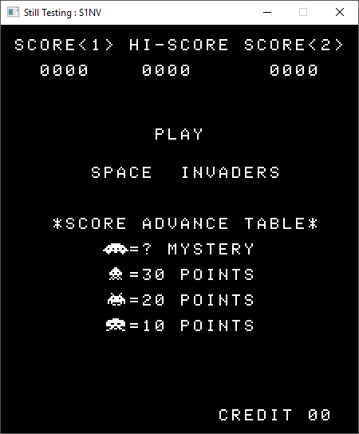
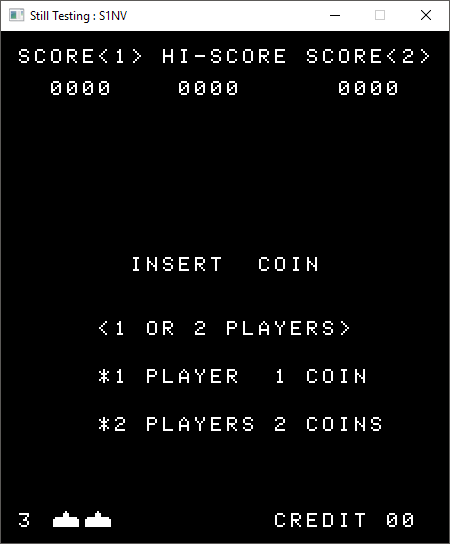
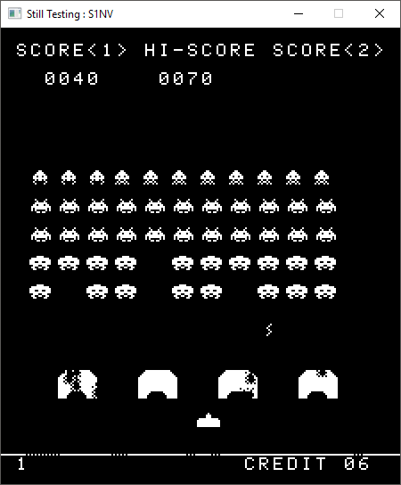

# S1NV_emu
A Space Invaders Emulator written from scratch in C++ with SDL2

## Screenshots
  

## Version 0.1 (Initial release)
### What works:
- Full Intel 8080 emulation
- Graphic in glorious back and white at 2x resolution
- Sound
- Joystick

### To-Do list
- Fix DAA opcode implementation (this cause an incorrect rap presentation of score for some values)
- Add color overlay (the game indeed doesn't have support for colors at all, at the time the illusion of color was created by applying a colored plastic overlay over the cabinet's CRT display)
- Add custom emulator settings (custom controls' layout, custom zoom level...)
- Add cabinet settings' selection (number of lives, bonus life)
- Other (please suggest)

## How to play
Before you can play you should have the actual Space Invaders rom in form of four distinct files named invaders.e/f/g/h

> The ROM files are copyrighted material and you aren't supposed to posses a copy of it without an explicit permission from the copyright owners.

### Windows
The libraries needed are provided with the windows binaries, you should be able to play just by double clicking on SINV_emu.exe

### GNU/Linux
Before you can play you need to install SDL2 and SDL2_mixer, this process can be different depending on your bistro.
On Debian based bistro you can simply execute:

	 sudo apt-get install libsdl2-2.0-0 libsdl2-mixer-2.0-0 
The *-dev* packets aren't needed unless you intend to compile the software by yourself.

After that, enter the directory containing the executable from a terminal and type

	./S1NV_emu
The program should run just fine.

### Controls
|Keyboard|Game |
|--|--|
| 1 | 1 Player mode |
|2|2 Players mode|
|3|Insert coin|
|Arrow Keys|Move|
|Space|Shoot|

## Building from sources

Before you can compile this software from source you need SDL2 and SDL_mixer development libraries.

### Windows
To compile under Windows I strongly recommend getting the last version of Microsoft Visual Studio community edition. Properly configure the building environment can be tricky, if you are not familiar with this kind of process I strongly recommend following this amazing tutorial provided by Lazyfoo:
[Setting up SDL 2 on Visual Studio 2010 Ultimate](http://lazyfoo.net/tutorials/SDL/01_hello_SDL/windows/msvsnet2010u/index.php) 

Even if it's intended for VS2010 the procedure should be the same even on the newer versions (I use VS2017 and it works exactly the same).
After that you should repeat the exact same process to install SDL_mixer, the development libraries can be downloaded from here:
[SDL2_mixer-devel-2.0.2-VC.zip](https://www.libsdl.org/projects/SDL_mixer/release/SDL2_mixer-devel-2.0.2-VC.zip)

### GNU/Linux
To install the needed libraries I recommend once again to follow the tutorial by Lazyfoo:
[Setting up SDL 2 on Linux](http://lazyfoo.net/tutorials/SDL/01_hello_SDL/linux/index.php)

Doing that you also need to install *SDL2_mixer-dev* in the exact same way.
On Ubuntu/Debian the installation process should indeed be as simple as typing:

	 sudo apt-get install libsdl2-mixer-dev-2.0-0
 
Then start compiling just access the source directory from a terminal and type
 
And then enter the source code directory and type:

	 make
You should be able to compile without problems, if this isn't the case and you receive an error SDL related chances ar that you need to tweak your Makefile at the line:
> COMPILER_FLAGS = -w -I/usr/include/SDL2 -L/usr/lib/x86_64-linux-gnu

To select the right folder for SDL2 headers.
